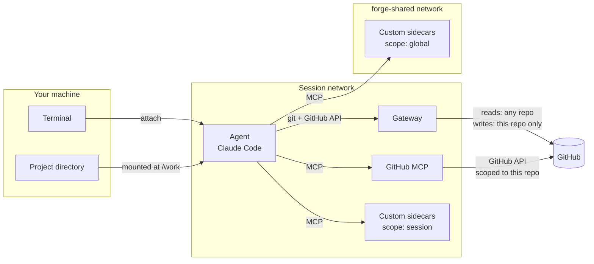

When you run `claude-forge start`, it:

1. Detects the current project (git remote, directory)
2. Resolves authentication credentials
3. Creates a Docker network for the session
4. Starts a **gateway** container that proxies the agent's git and GitHub API
   traffic with write restrictions
5. Starts a **GitHub MCP** sidecar scoped to the current repository
6. Starts any custom **container MCP sidecars** from `config.yaml` — on the
   session network (`scope: session`) or the shared `forge-shared` network
   (`scope: global`, a single instance reused by every session rather than
   started per session)
7. Writes the MCP server list for Claude Code: the built-in `github` server,
   plus each custom sidecar **only if it actually started**,
   plus remote (`http`/`sse`) and `stdio` custom servers
8. Starts an **agent** container running Claude Code with your project mounted
   at `/work` (and its own isolated Docker daemon inside, when `docker.enabled`
   is set)
9. Attaches your terminal (interactive) or waits for completion (with `-p`)

GitHub access is restricted at two independent points:

- The **gateway** proxies the agent's own git and GitHub API traffic: it can
  read from any repository, but pushes and PR creation are only allowed on the
  current project's repository.
- The **GitHub MCP** sidecar talks to the GitHub API directly with your token,
  but it is launched scoped to the current repository (`--owner`/`--repo`) —
  it cannot operate on other repos.

Remote MCP servers (`type: http`/`sse`) are reached over the agent's normal
outbound internet — the gateway only mediates GitHub traffic. See
[MCP Servers]() for the full model.

## Docker-in-Docker (optional)

By default the agent has no Docker access at all: the host's Docker socket is
never mounted, in any configuration. Setting `docker.enabled` in `config.yaml`
starts a **separate Docker daemon inside the agent container** (which then runs
`--privileged`), so Claude Code can build and run its own containers. That
daemon is private to the session — the agent cannot see or control the host's
containers, claude-forge's own containers, or those of other sessions.
