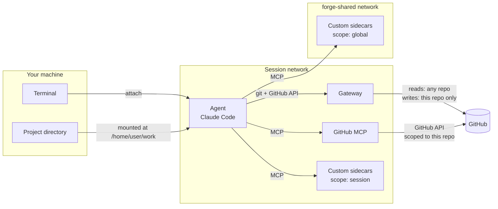

When you run `claude-forge start`, it:

1. Detects the current project (git remote, directory)
2. Resolves authentication credentials
3. Creates a Docker network for the session
4. Starts a **gateway** container that proxies the agent's git and GitHub API
   traffic with write restrictions
5. Starts a **GitHub MCP** sidecar scoped to the current repository
6. Starts any custom **container MCP sidecars** from `config.yaml` — on the
   session network (`scope: session`) or the shared `forge-shared` network
   (`scope: global`, a single instance reused by every session rather than
   started per session)
7. Writes the MCP server list for Claude Code: the built-in `github` server,
   plus each custom sidecar **only if it actually started**,
   plus remote (`http`/`sse`) and `stdio` custom servers
8. Starts an **agent** container running Claude Code with your project mounted
   at `/home/user/work`, and a generated `CLAUDE.md` that tells the session it
   is running in a container (and its own isolated Docker daemon inside, when
   `docker.enabled` is set)
9. Attaches your terminal (interactive) or waits for completion (with `-p`)

```mermaid
flowchart LR
    subgraph host [Your machine]
        T[Terminal]
        P[Project directory]
    end
    subgraph sn [Session network]
        A[Agent<br/>Claude Code]
        G[Gateway]
        M[GitHub MCP]
        S[Custom sidecars<br/>scope: session]
    end
    subgraph shared [forge-shared network]
        C[Custom sidecars<br/>scope: global]
    end
    T -- attach --> A
    P -- mounted at /home/user/work --> A
    A -- git + GitHub API --> G
    A -- MCP --> M & S & C
    G -- "reads: any repo<br/>writes: this repo only" --> GH[(GitHub)]
    M -- "GitHub API<br/>scoped to this repo" --> GH
```

GitHub access is restricted at two independent points:

- The **gateway** proxies the agent's own git and GitHub API traffic: it can
  read from any repository, but pushes and PR creation are only allowed on the
  current project's repository.
- The **GitHub MCP** sidecar talks to the GitHub API directly with your token,
  but it is launched scoped to the current repository (`--owner`/`--repo`) —
  it cannot operate on other repos.

Remote MCP servers (`type: http`/`sse`) are reached over the agent's normal
outbound internet — the gateway only mediates GitHub traffic. See
[MCP Servers]() for the full model.

## Container instructions

Claude Code in the session is given two facts it cannot work out for itself:

- It is running inside a container, not on your machine. The filesystem,
  installed packages, processes and network belong to the container, and
  everything outside the mounted paths is discarded when the session ends.
- Your project directory is bind-mounted at `/home/user/work`, which is also
  the working directory. The same files live under a different absolute path on
  your machine, so when the session names a file it writes the path relative to
  the workspace (`internal/forge/orchestrator.go`) rather than the
  container-absolute path (`/home/user/work/internal/forge/orchestrator.go`),
  which would not resolve for you.
- GitHub is reachable only through the session's gateway, which holds the
  credentials — so the session knows to clone and fetch via
  `https://github.com/...` (rewritten to the gateway) or, when a remote is an
  SSH URL the gateway cannot proxy, via
  `http://gateway:8080/github.com/<owner>/<repo>.git`. Private repositories work
  with no setup inside the container.

`claude-forge` regenerates these instructions at
`~/.config/claude-forge/container-CLAUDE.md` at the start of every session and
mounts them read-only at `/etc/claude-code/CLAUDE.md` — Claude Code's
managed-memory path on Linux, loaded on every run ahead of your own user and
project memory. (`/CLAUDE.md` would not work: Claude Code's search for project
memory walks up from the working directory only as far as the directory below
the filesystem root.)

Because the file is regenerated on every session, edits to it do not survive.
Your own instructions belong in the project's `CLAUDE.md` — or, to apply to
every project, in `~/.claude/rules/` on the host, which is mounted into each
session and read as user memory.

## Docker-in-Docker (optional)

By default the agent has no Docker access at all: the host's Docker socket is
never mounted, in any configuration. Setting `docker.enabled` in `config.yaml`
starts a **separate Docker daemon inside the agent container** (which then runs
`--privileged`), so Claude Code can build and run its own containers. That
daemon is private to the session — the agent cannot see or control the host's
containers, claude-forge's own containers, or those of other sessions.
